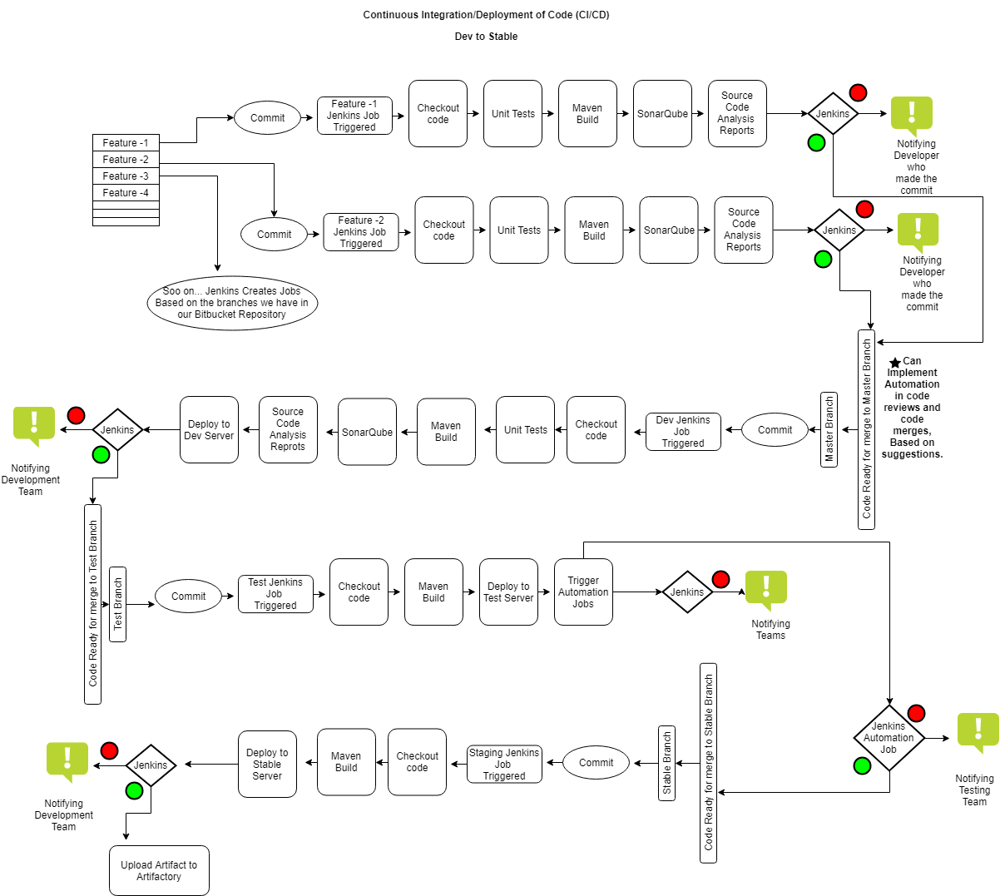

DevOps Improvements.
Prepared By: DevOps Team
Note: This is not an official plan. We are just putting forth, to get suggestions from Team. Before, we go for Execution. 
DevOps

DevOps is the combination of cultural philosophies, practices, and tools that increases an organization’s ability to deliver applications and services at high velocity, evolving and improving products at a faster pace than organizations using traditional software development and infrastructure management processes. 

This speed enables organizations to better serve their customers. So, Below are some of the improvements that we are proposing in our project to smoothen our processes and to do Development and Deployments as fast as possible. 

	Continuous Integration/Deployment/Monitoring.
	Infrastructure as a Code (IaaC) and Configuration Management.

Continuous Integration/Deployment/Monitoring.
1.	Continuous
1.	Integration:
	Continuous Integration is the process where developers integrate code into Bitbucket frequently, preferably several times a day. Each integration
	So in our project, whenever a developer commits his/her changes in the Bitbucket. Respective commit will initiate a build in Jenkins and based on the type of committed branch, Jenkins initiates respective job in Multi-Branch Pipeline.
	That is, If the commit is from a feature branch, Jenkins will execute its respective Feature Branch Job. Please click on this link to see, How Jenkins Multi-Branch pipeline works.
2.	Deployment:
	Continuous deployment is a strategy for software releases, where any code commit that passes the automated testing phase is automatically released into the Development or Production environment, making changes that are visible to the software's users.
	Right now, Our plan is to implement this only in environments Dev, Test and Stable. We can extend this to Production once we have confidence on this system.
3.	Monitoring:
	Continuous monitoring is the process and technology used to detect compliance and risk issues associated with an organization's operational environment. The operational environment consists of people, processes, and systems working together to support efficient and effective operations.
	One of the tools that we are started using for this purpose is New Relic Application Performance Monitoring ( APM ) Feature. We can use this track and report any critical issues.
	Implementing Configuration Management for our Infrastructure also checks for any changes in the environment configuration and throws a warning to the System Admin. if there is any undesired configuration.
	More explanation below.

2.	CI/CD Workflow:
o	This is the Process of CI/CD (Continuous Integration and Continuous Deployment) from Dev, Test and Stable environments.
o	This is where the need for Jenkins Multi-Branch pipelines comes. As, it will automatically create Jenkins jobs based on the type of the branch. It will be easy for DevOps to manage the Jenkins jobs. The most types of branches in our Bitbucket are a feature branch, Hot-fix branch, Bug-fix branch, Master branch, test branch, stable branch and live branch.
o	Jenkins will create Jenkins Jobs automatically based on the type of the branch and will run the job with any commit to that branch. so, we can implement all the steps that we need to for all the branches. 
o	we do not want to include the Live branch in this work flow so, we have made an exception policy to not to detect the live branch. So, this CI/CD is only for Code moving from Developers commit in Bitbucket till Deployment in Stable environment. 

 
o	The components like Unit tests, Source code analysis reports and Automated test cases may not be available right now. but, we need to add them to the pipelines whenever they are available to make this process more trustworthy.
